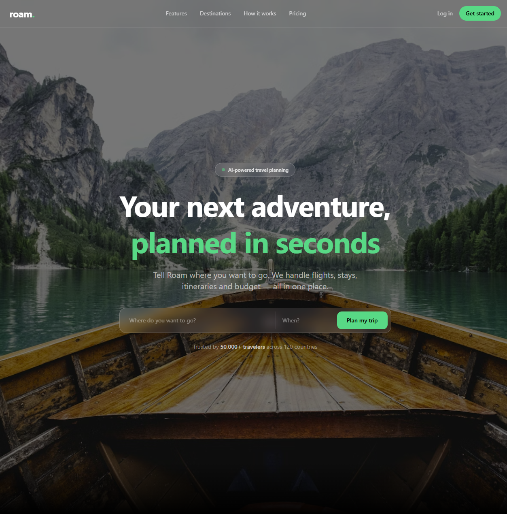
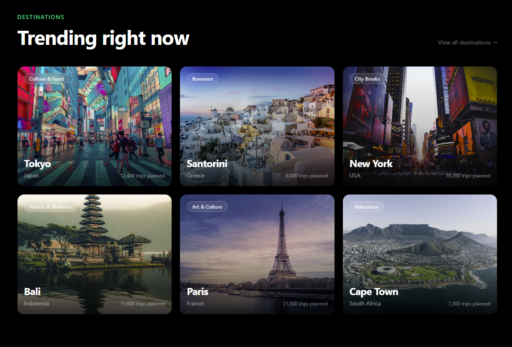
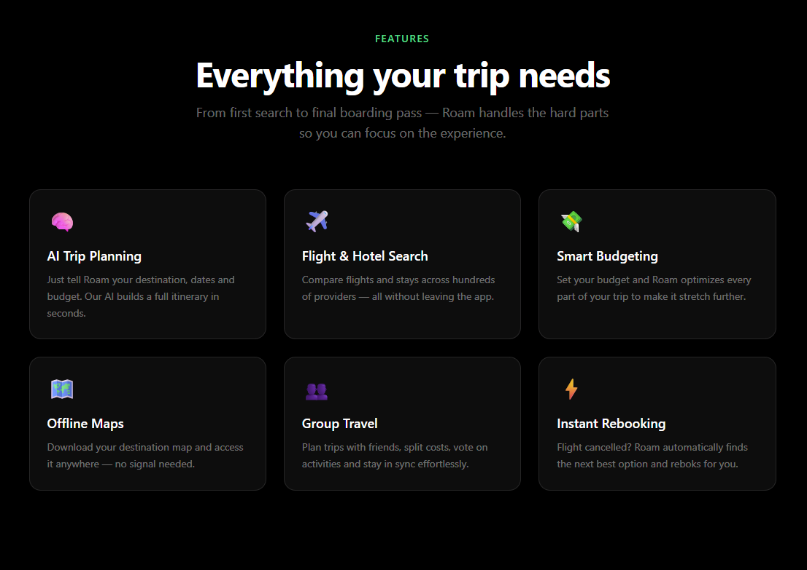
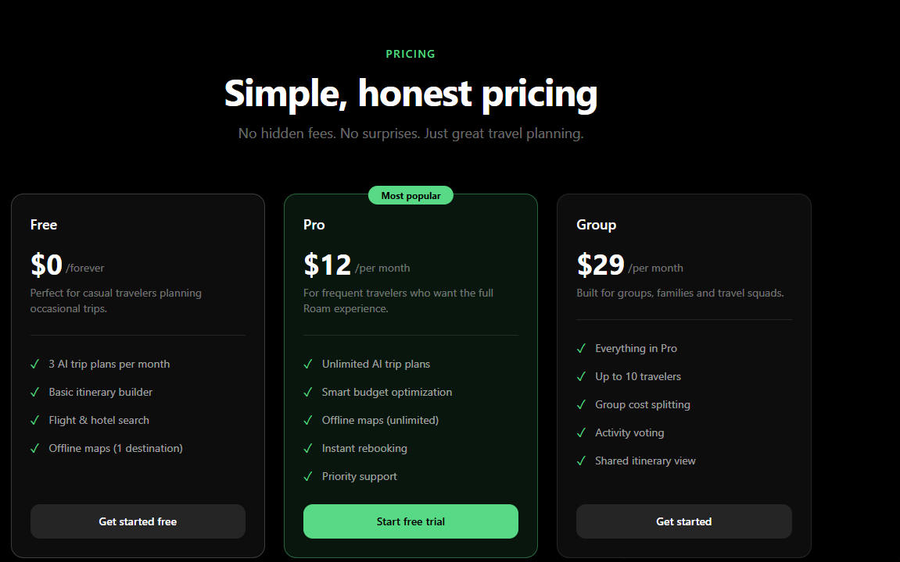

# Roam — AI Travel Planner
A concept product landing page built as part of my UI/UX portfolio.

---

## Overview
Roam is a fictional AI-powered travel planner. Built to showcase a dark, premium landing page design with a focus on typography, spacing and visual hierarchy.

---

## Sections
Navbar · Hero · Social Proof · Features · How It Works · Destinations · Testimonials · Pricing · CTA · Footer

---

## Screenshots

| Hero | Destinations |
|------|-------------|
|  |  |

| Features | Pricing |
|----------|---------|
|  |  |

---

## Stack
React · TypeScript · Tailwind CSS · Vite

---

© 2026 Liandro Goagoseb — All Rights Reserved
